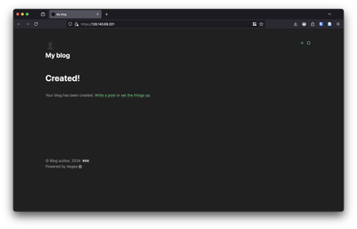
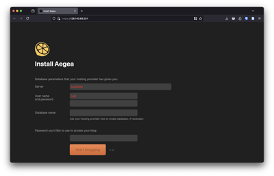

## Aegea Rollout

This repository describes a one-command [Aegea](https://blogengine.me/) blog engine rollout using Terraform and Ansible. The state is seemlessly passed from Terraform to Ansible using the [terraform-inventory](https://www.ansible.com/blog/providing-terraform-with-that-ansible-magic/) plugin.




### Roadmap

The only missing features are **automated DNS** and **let's encrypt certificate management**.

### Requirements

Hetzner Cloud API token and SSH key ID are required. The following software versions are required:

```
terraform>=1.9.8.
ansible>=[core 2.17.3]
tar
unzip
```

### Usage

#### Variables

Use [terraform.tfvars.example](terraform/terraform.tfvars.example) as reference. The meaning of the variables is as follows:

```tfvars
hcloud_token  = "[redacted]P6bEQ0U0X5afptrpU5DrFL9o2pjYJCRJDyFZgfxg33TWuKaw"  #  Hetzner Cloud API token.
image         = "rocky-9"
server_type   = "cpx11"
location      = "nbg1"
ssh_key_id    = "user@MacBook-Pro.local"  # SSH key ID in Hetzner.
playbook_path = "../ansible/apache.yml"
```

#### Example

The following will execute terraform to spawn a VM and then ansible to install the Aegea blog engine.

```bash
make
```

To cleanup.

```bash
make terraform-destroy
```
